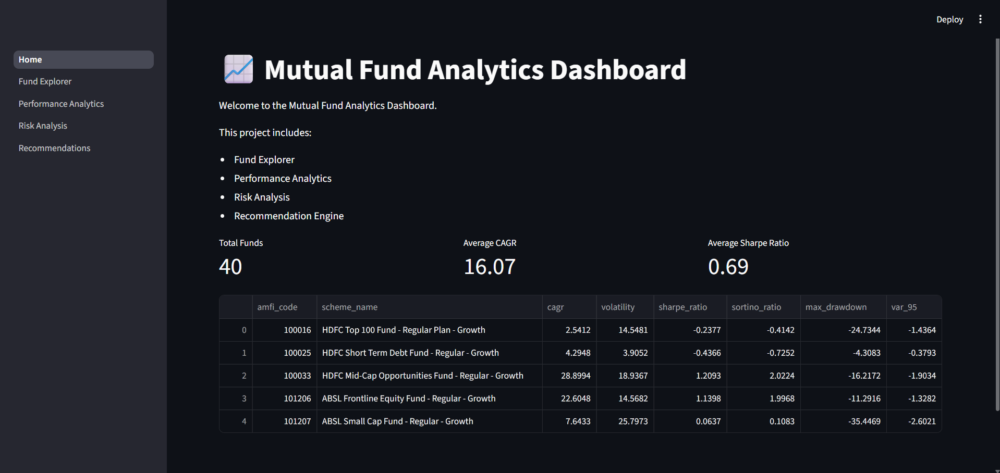
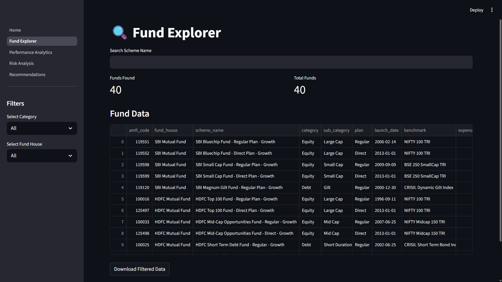
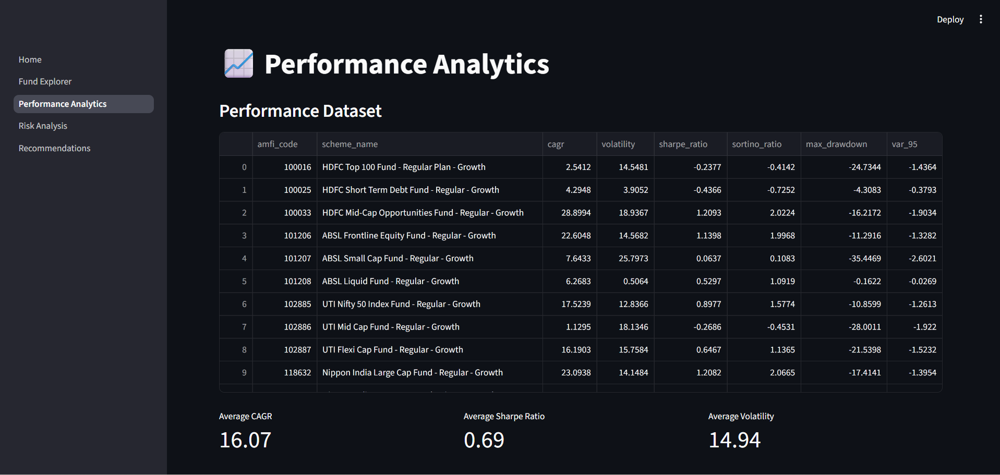
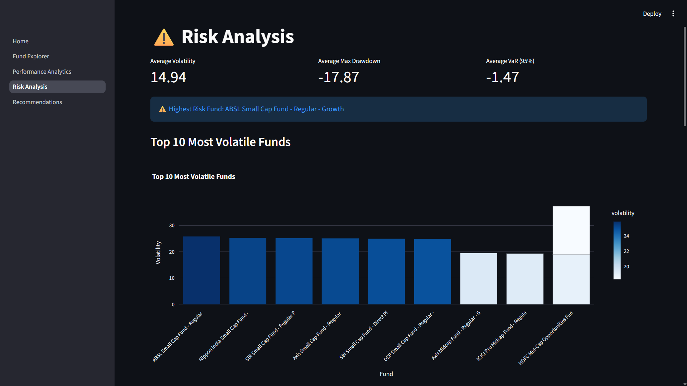
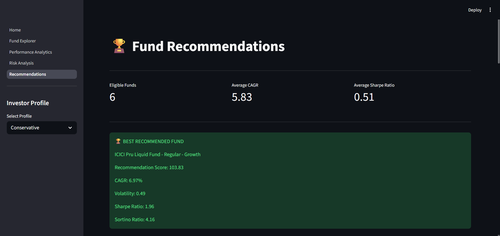

# 📈 Mutual Fund Analytics Dashboard

An end-to-end Data Analytics and Recommendation System for Mutual Funds built using Python, Pandas, SQLite, Machine Learning, and Streamlit.

The project provides data exploration, performance analysis, risk analysis, and personalized fund recommendations through an interactive dashboard.

---

## 🌐 Live Demo

[🔗 Open Mutual Fund Analytics Dashboard](https://mutualfundanalytics-a5cjfcqbqf5bb9bjydutnb.streamlit.app/)

---

## 🚀 Project Overview

This project analyzes mutual fund datasets and generates actionable insights for investors.

The dashboard allows users to:

- Explore mutual fund schemes
- Analyze fund performance metrics
- Evaluate investment risk
- Receive personalized recommendations
- Download filtered and recommended results

---

## ✨ Features

### 🔍 Fund Explorer
- Search mutual funds
- Filter by category
- Filter by fund house
- Download filtered data

### 📊 Performance Analytics
- CAGR Analysis
- Sharpe Ratio Analysis
- Sortino Ratio Analysis
- Performance Summary Metrics

### ⚠️ Risk Analysis
- Volatility Analysis
- Maximum Drawdown Analysis
- Value-at-Risk (VaR) Analysis
- Top Risky Funds Identification

### 🏆 Recommendation Engine
- Conservative Investor Profile
- Moderate Investor Profile
- Aggressive Investor Profile
- Top Recommended Fund Selection

---

## 🛠 Tech Stack

### Programming
- Python

### Data Processing
- Pandas
- NumPy

### Database
- SQLite

### Machine Learning
- Scikit-Learn

### Visualization
- Matplotlib
- Seaborn
- Plotly

### Dashboard
- Streamlit

---

## 🏗 Project Architecture

```
Raw Mutual Fund Data
        │
        ▼
Data Cleaning & Validation
        │
        ▼
Feature Engineering
        │
        ▼
SQLite Database
        │
        ▼
Analytics Engine
        │
        ├── Performance Analytics
        │
        ├── Risk Analytics
        │
        └── Recommendation Engine
                │
                ▼
        Streamlit Dashboard
```

---

## 📂 Project Structure

```text
Mutual_Fund_Analytics/
│
├── dashboard/
│   ├── Home.py
│   └── pages/
│       ├── 1_Fund_Explorer.py
│       ├── 2_Performance_Analytics.py
│       ├── 3_Risk_Analysis.py
│       └── 4_Recommendations.py
│
├── data/
│   ├── raw/
│   ├── processed/
│   └── db/
│
├── notebooks/
│
├── reports/
│   └── screenshots/
│
├── scripts/
│
├── requirements.txt
└── README.md
```

---

# 📸 Dashboard Screenshots

## Home Page



---

## Fund Explorer



---

## Performance Analytics



---

## Risk Analysis



---

## Recommendations Engine



---

## ⚙️ Installation

Clone the repository:

```bash
git clone https://github.com/ArunVijaykumarcsds/Mutual_Fund_Analytics.git
```

Move into project directory:

```bash
cd Mutual_Fund_Analytics
```

Install dependencies:

```bash
pip install -r requirements.txt
```

Run Streamlit dashboard:

```bash
streamlit run dashboard/Home.py
```

---

## 📈 Key Analytics Metrics

The project computes:

- CAGR
- Volatility
- Sharpe Ratio
- Sortino Ratio
- Maximum Drawdown
- Value at Risk (VaR)

---

## 🔮 Future Improvements

- Live Mutual Fund API Integration
- Portfolio Optimization Module
- Advanced ML Recommendation System
- Investment Goal Planning
- Cloud Deployment

---

## 👨‍💻 Author

**Arun Vijaykumar**

Data Analytics | Machine Learning | Data Science

GitHub:
https://github.com/ArunVijaykumarcsds
